# Как живется в Сингапуре: история айтишника, который переехал по рабочей визе

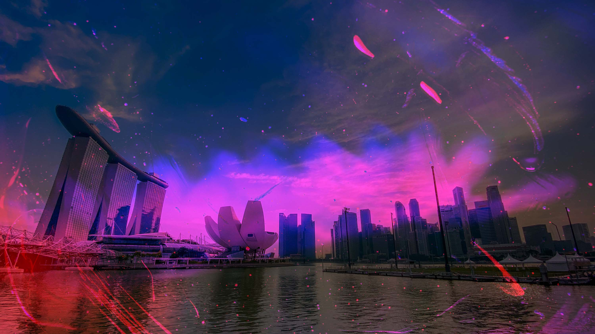

Алекс уехал в Сингапур из Питера. Он поделился, каково жить и работать в стране с другим климатом, менталитетом и культурой — где сочетаются смертная казнь и законопослушность, физические наказания и доброжелательность, жесткие запреты на домашние растения и животных и религиозность. А айтишники не находятся в привилегированном положении и должны знать и уметь сразу все.

Меня зовут Саша Кичев, для коллег — Алекс, в твиттер — [@glorfindeil](https://twitter.com/glorfindeil). Я уехал в Сингапур и неторопливо веду канал об этом в [телеграм](https://t.me/kichsing).

Я работаю в EPAM на позиции Delivery manager. Для тех, кто не знаком с нашей терминологией, поясню: это “тимлид-переросток”, одна из возможных следующих ступеней развития тимлида.

Изначально я Java-разработчик, но всегда работал как фуллстек и владею смежными технологиями. Сам код уже практически не пишу, но активно задействован в построении архитектур и технологических решений. В июне этого года я переехал с девушкой из Санкт-Петербурга в Сингапур.

В этой стране мы пока только обустраиваемся. Помимо работы стараюсь вернуться и к своему хобби — музыке, которой всегда много занимался. Все мои музыкальные корни либо оборвались, либо мне пришлось болезненно менять формат. Поэтому здесь и сейчас я проращиваю новые и пытаюсь возродить старые.

## Почему мы выбрали Сингапур

Релокация в Сингапур у нас с девушкой должна была быть не экстренной, но из-за войны сильно ускорилась. Готовиться к релокации я начал ещё в 2021 году. У нас с девушкой давно созрело желание пожить в цивилизованном государстве с работающими социальными институтами. Очень хотелось испытать этот экзотический, небывалый expierence, который мы раньше могли наблюдать только как туристы. В придачу, я, наверное, еще в прошлом году чувствовал, что что-то назревает, учитывая новости и тенденции.

Компания EPAM, в которой я сейчас работаю, релоцирует не в любую страну. Можно релоцироваться только туда, где есть офис, и где на тебя есть спрос как на специалиста. Соответственно, список вариантов сократился. В итоге после всех обсуждений мы выбирали между США и Сингапуром.

Остановились на Сингапуре, потому что после Питера здесь жить привычнее. Эти города похожи масштабом, инфраструктурой, развитостью городского транспорта.

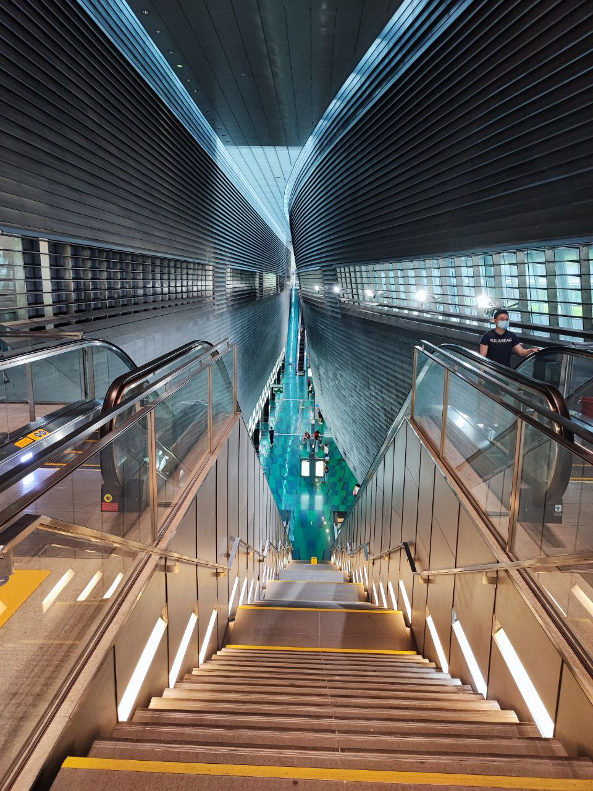

_Станция метро. Фото из личного архива автора_

В Америке обязательно нужен свой дом, своя машина, а я садиться за руль не собирался — меня бы сразу арестовали, уж такой из меня водитель. 

К тому же изначально мы решили, что Сингапур — не последняя наша локация. И, учитывая особенности жизни здесь, мы до сих пор к этому склоняемся. Впечатления о Сингапуре у нас положительные, но у любой локации есть свои плюсы и минусы.

## В Сингапуре есть жесткие законы, но их существование оправдано

Есть очень много стереотипов про жестокость законов Сингапура. С одной стороны, это так: тут действует смертная казнь за ввоз наркотиков и телесные наказания — это правда. Но сейчас система перестраивается на более рациональный лад, сингапурское общество во многом следует за американским.

Во-вторых, все эти жестокие условия нужны были, чтобы построить такое развитое общество в Азии. А когда это общество сложилось, когда выросло не одно поколение людей, которые понимают, что такое цивилизованная жизнь, тогда начинаются послабления. Но всё равно нужно быть осторожным.

Здесь есть законы и ограничения, которые могут показаться нелепыми. Почему, например, запрещено держать на окне горшки с цветами? Но, когда начинаешь разбираться, то понимаешь, что всё очень логично. Сингапур — это страна, которая победила комаров. Здесь всегда свирепствовала лихорадка Денге, смертность от которой выше, чем у COVID-19. Главные переносчики этой лихорадки — комары. Поэтому и запретили горшки с цветами ставить на окно, чтобы комары не размножались в воде. Комаров в городах стало меньше, лихорадку эту победили. Сейчас ей очень мало болеют, в основном в неблагополучных районах.

Все эти наказания плетьми существуют не просто так. Это адекватные меры, чтобы люди начали жить по правилам. Современные сингапурцы очень законопослушные.

_Социальная реклама об ответственности за вуайеризм. Фото из личного архива автора_

Когда началась пандемия COVID-19, здесь все беспрекословно сидели дома и не нарушали никаких законов. Все носили маски вплоть до недавнего времени. Когда все вокруг тебя следуют правилам, очень легко следовать им самому. Потому что когда половина людей носит маски, а половина — нет, ты не захочешь носить маску. Но когда все носят маски, то чувствуешь себя неловко без неё.

_В ресторанах строго запрещено сидеть без маски, когда ты не пьешь и не ешь, поэтому везде посетителям сразу приносят холодную воду, чтобы маски можно было снять. Фото из личного архива автора_

## У сингапурцев западное мышление

Казалось бы, сингапурцы — азиаты, а русские — скорее люди Запада. Но я бы сказал, что у современных молодых сингапурцев более западная модель мышления, а у россиян более восточная, потому что они росли в разном обществе. В Сингапуре очень сложно судить о менталитете, потому что жители европейских стран, кажется, более-менее похожи, а Азия — пёстрое полотно. Здесь люди даже одних и тех же национальностей, выросшие в более или в менее традиционных семьях, могут иметь совершенно разный менталитет. Поэтому важно учитывать, с кем и о чём ты говоришь и быть максимально деликатным. К китайским китайцам один подход. К сингапурским китайцам — другой. А еще есть тайцы, малайцы, вьетнамцы, индусы. Причём есть те, кто уже вырос в цивилизованном обществе, и те, кто очень близок к традиционным корням. Соответственно, они даже между собой достаточно сильно отличаются.

В целом, если как-то усреднять азиатский менталитет, здесь меньше формальных договорённостей и больше negotiation, искусства договариваться. В целом азиатское общество живёт по принципу одного большого базара. Ты можешь от кого-то что-то получить не тогда, когда предложишь выгодные условия, а когда завоюешь доверие. После этого взаимовыгодные условия вы как-нибудь найдёте. К Сингапуру это имеет отношение в меньшей мере, потому что это уголок Запада. Сингапур, Гонконг — это некие финансовые центры, где восточная модель в чистом виде не работает. Здесь даже принимаются меры, чтобы урезать некоторые традиционные практики. Например, я слышал, что законодательство запрещает подарки бизнес-партнёрам, даже на небольшие суммы — они могут быть расценены как взятка.

## Что мне нравится в Сингапуре

До переезда я уже бывал в Сингапуре, поэтому меня уже было не удивить его потрясающими небоскрёбами. Но оказалось, что Сингапур ещё и очень зелёный, причём именно озеленённый: здесь везде какие-то лианы, разные растения, даже дома покрыты зеленью. Есть знаменитый отель, который больше похож на лес.

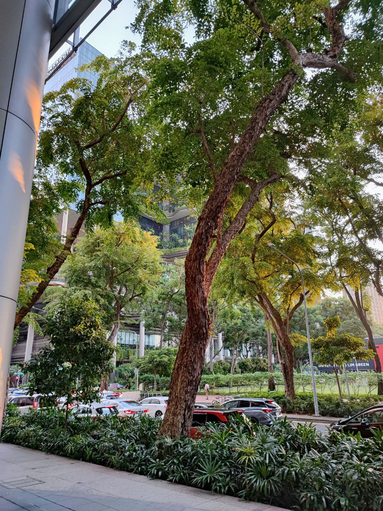

_Зелёные улицы Сингапура. Фото из личного архива автора_

Сингапур одновременно очень хай-тековый, но в то же время очень зелёный, и это все было продумано специально. В городе много парков, посадок, деревьев прямо из тротуаров и деревьев на домах, бизнес-центрах и отелях. Выглядит очень внушительно.

Сингапур хорош тем, что и в соседних странах восхитительная природа. Долететь в них на лоукостере примерно так же легко, как на автобусе доехать из Питера до Таллина. То есть природа вокруг Сингапура тоже очень доступна.

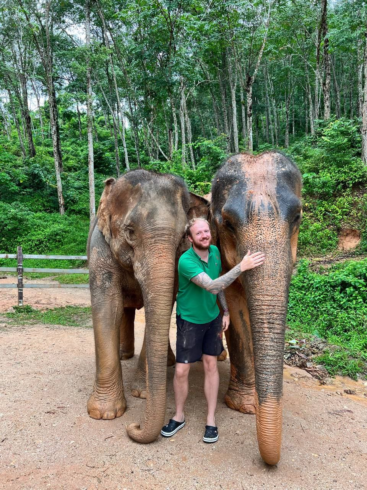

_На Пхукет лететь два часа. Фото из личного архива автора_

Процентов двадцать людей, находящихся вечером на улице, это те, кто вышел на пробежку. Сингапур абсолютно помешан на спорте. Здесь есть всё, что нужно для занятий любыми видами спорта. Все здорово выглядят — спортивно, молодо. Такая здесь мода.

Здесь немного типичных туристических локаций, но они абсолютно восхитительны. Например, знаменитый отель Marina Bay и сад за ним.

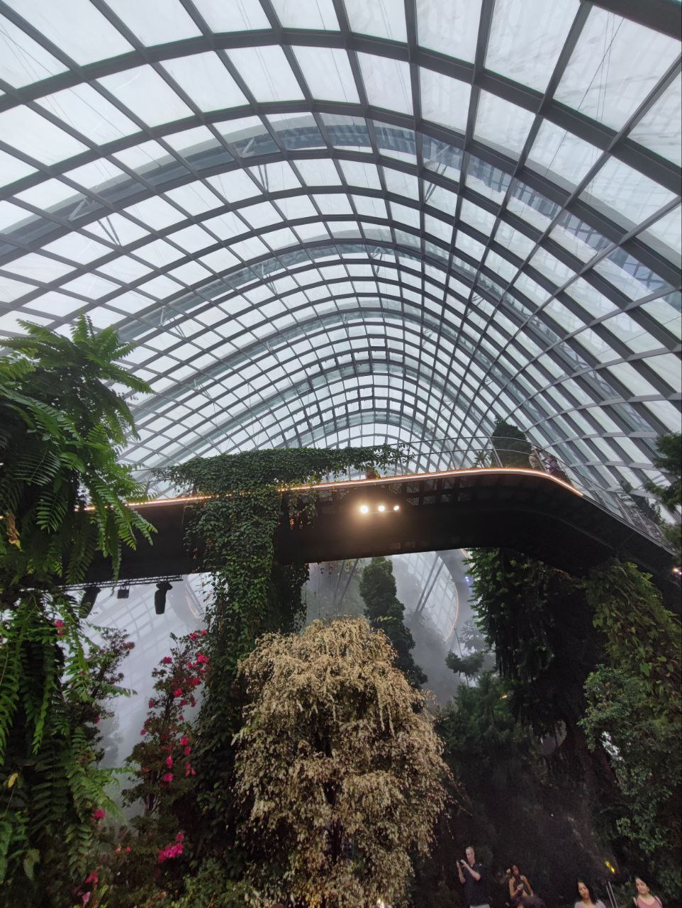
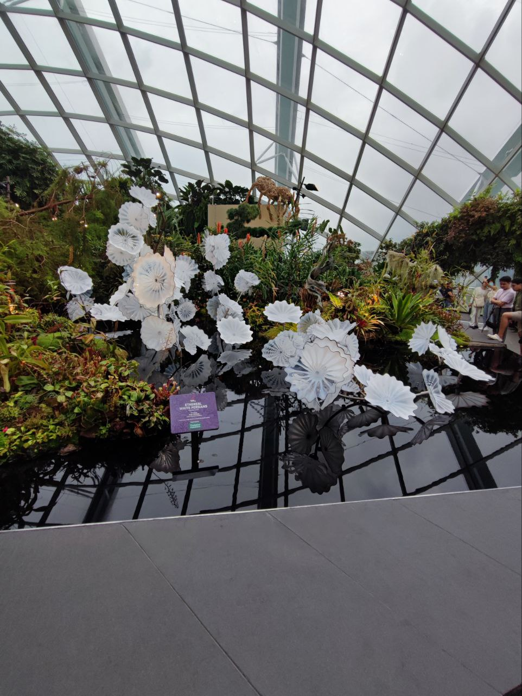
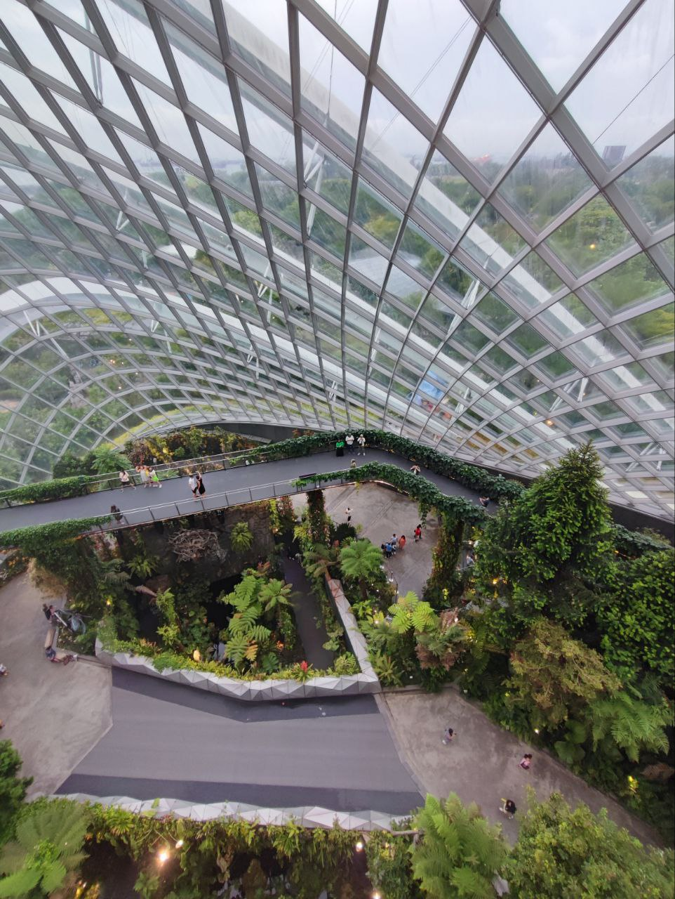

_Cloud Forest in Gardens By Marina Bay Фото из личного архива автора_

Небольшой список достопримечательностей можно посмотреть в любом путеводителе. Но с точки зрения жизни здесь больше всякого разнообразия. Вообще Сингапур живёт шоппингом. Та же еда: чтобы попробовать что-то вкусное и необычное, здесь ходят не в рестораны, а в огромные моллы, где всегда есть множество заведений с разной кухней.

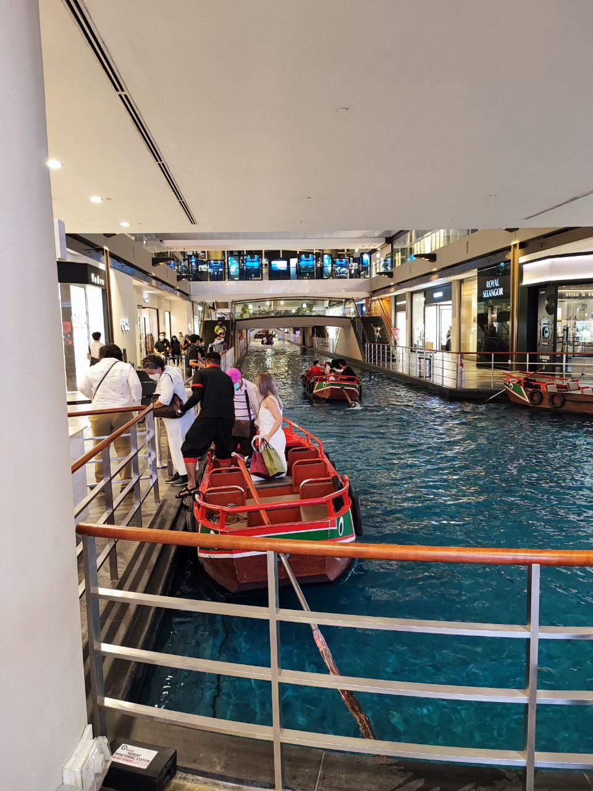
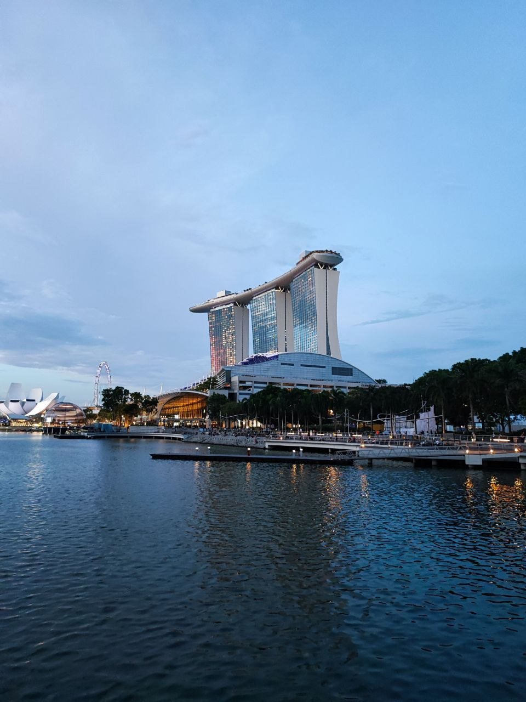

_Торговый центр Marina Bay, на нижнем этаже которого посетители передвигаются в гондолах по воде. Фото из личного архива автора_

Сингапурцы с детства говорят по-английски, местные знают язык на уровне native. Конечно, на слух “синглиш”, или сингапурский английский, воспринимается как помесь каких-то местных наречий, как английский с вкраплениями малайского, китайского и чего-то ещё. Местные жители говорят с заметным акцентом: тянут все эти гласные: мээээм, сээээр и т.д. Побыв неделю-две в этой культуре, начинаешь понимать, что они говорят.

Если сравнивать с остальной Азией, в Сингапуре высокий уровень жизни, хорошая медицина и прочее. Предполагаю, что в столицах других стран Азии может быть также. По уровню жизни, наверное, в топе Тайвань, Гонконг, Сингапур. Но я не проверял. В общем, здесь с этим правда всё неплохо. Здесь всё какое-то новое, свежее, не обшарпанное. Везде чисто за редким исключением.

_Уровень социального развития нации - стенд, где можно испытать прокладки в обычном продуктовом магазине. Фото из личного архива автора_

Люди здесь позитивнее, спокойнее и воспитанней. В общественных местах огромное количество семей с детьми. Все ведут себя воспитанно, не орут, ничего не требуют. Я наблюдал такую ситуацию: в магазине на одной из касс самообслуживания стояла корзинка, означающая, что данная касса закрыта. Взрослые это понимают, но подошёл ребёнок лет восьми, увидел “беспорядок” и попытался отнести корзинку туда, где они должны лежать. Ему объяснили: поставь назад, это означает, что закрыто. Он очень сильно расстроился, когда ему сказали, что он сделал неправильно.

Граждане Сингапура с самого детства законопослушные, для них очень важна семья. Они могут до взрослого возраста советоваться с родителями по вопросам, где нужно взять на себя ответственность.

Местные очень добрые. Здесь даже есть социальная реклама, показывающая различные ситуации, где можно проявить доброту, и призывающая так делать.

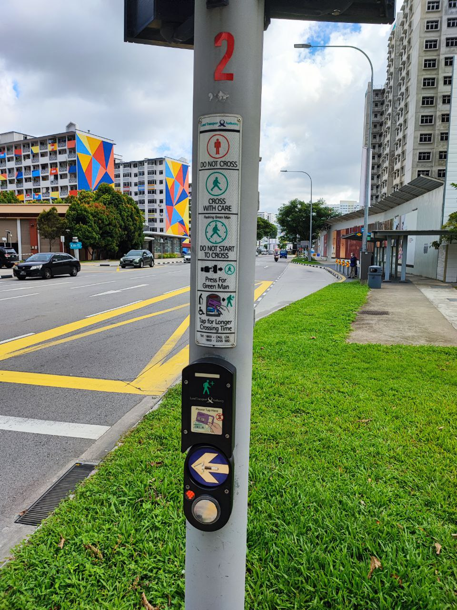

_Светофор, адаптированный для маломобильных и пожилых горожан. Фото из личного архива автора_

## Что мне не нравится в Сингапуре

Я не сразу это почувствовал, но в Сингапуре очень традиционалистское общество. Здесь главное — дом, семья, любовь и так далее. С одной стороны, это хорошо, все молодые сингапурцы имеют по двое-трое детей и выглядят весьма довольными. Но отсюда вытекает некая зашоренность, некий шовинизм и неприятие нового. Однополые отношения сейчас только на этапе декриминализации. Буквально в прошлом году за это натурально сажали в тюрьму.

Если играешь тяжёлую музыку, к тебе вполне серьёзно могут прийти с вопросами из-за сатанинской атрибутики, потому что они не понимают, что это всё мишура и особенность субкультуры. Здесь заметно влияние религии, к ней очень серьёзно относятся.

Изначально я рассматривал как недостаток относительное уменьшение зарплаты. Потому что, если считать в средних зарплатах, в России я получал гораздо больше, чем в Сингапуре. Но это прежде всего связано с тем, что здесь нет такого дикого неравенства доходов. Заметно выше доходы только у бизнесменов, а разгон зарплат у наёмных работников небольшой.

С другой стороны, так как Сингапур — это страна шопинга, здесь твоя покупательская способность в целом повышается. Здесь техника и другие производственные товары обходятся по факту в два раза дешевле. Потому что Тайвань и Китай рядом, всё импортируется. Даже товары из Америки приходят очень быстро. Я заказывал себе синтезатор — он приехал за неделю! Я был очень сильно удивлён. Просто здесь очень хорошо налажены торговые маршруты, это ещё одна положительная особенность Сингапура.

Однако есть большое но: цена на жильё. Квартиры всегда были дорогие, но в последнее время они стали запредельно, неприлично дорогими. Мы переехали вдвоём, нам слегка легче в этом плане, так как мы оба работаем. Но если переезжаешь в одиночку, то готовься либо от 30 до 50 процентов дохода отдавать за жильё, либо жить не в таких хороших условиях, как до этого. Мы платим примерно 4200 местных долларов  (около 3 тысяч американских долларов) за двушку с выходом в бассейн, нормальной инфраструктурой в приличном центральном районе города. Не премиальное, но хорошее жильё обходится в Сингапуре дорого.

_Типичный HDB. Фото из личного архива автора_

Диджитализация и развитие технологий отстаёт от России, но это связано с тем, что в этой сфере мы были впереди планеты всей. В Сингапуре же до сих пор пользуются чековыми книжками, а  в приложениях очень популярных банков транзакции отображаются только на следующий день. Это мелочи, но на них обращаешь внимание.

Спокойная, размеренная жизнь, в которой главное развлечение — это шоппинг, не для всех. Из-за этой размеренности и бюрократические процессы тоже замедляются. Допустим, визу нам рассматривали в три раза дольше, чем должно было быть. Просто потому что здесь это происходит так.

С животными сюда переехать проблематично, жить с ними — тоже сложно. Мохнатым питомцам здесь очень жарко. В целом здесь всё максимально цивилизованно. Есть специальные зоны, куда можно ходить с собаками, чтобы они социализировались.

Насколько я понимаю, нужно даже сдать экзамен и получить специальное разрешение, чтобы держать дома кошку или собаку.

_Пространство для выгула и общения собак. Фото из личного архива автора_

В Сингапуре легализована проституция — видимо, выбрали из двух зол меньшее. А ещё, если у тебя нет медицинской страховки, то с трудом можно рассчитывать на получение медицинской помощи. Это типичная американская модель. Если страховку не оплачивает твоя компания, то тебе легче будет лечиться в России. Здесь ты можешь оказаться в ситуации, где ты брошен и тебе не готовы помочь. Я бы не назвал это социальной проблемой, это просто особенность устройства общества. Надо это просто знать.

Многие люди здесь покупают расширенные страховки за свой счет. В России это не принято, а здесь популярно страхование от несчастных случаев. Если с тобой что-то происходит, например, ты ломаешь руку, это окупается, поэтому insurance — очень развитая сфера.

## Легализация

Чтобы жить и работать в Сингапуре, нужно получить work permit. Нам выдали такую рабочую визу на два года. По истечению срока работодатели должны продлевать её через министерство труда — Ministry of Manpower. Это называется временное пребывание. Прожив в Сингапуре какое-то определённое время, можно подать заявку на permanent residence. Это почти гражданство: ты получаешь те же привилегии и преференции, какие получают местные.

Permanent residence получить практически невозможно, потому что в год их выдают какое-то ограниченное количество и всегда много заявок. Есть расовая квота: грубо говоря, 75% сингапурцев — китайцы, 15% — малайцы, 7% — индусы и статус permanent residence людям такой нации будет выдан в такой же пропорции. Белых людей здесь мало, они расово идентифицируются как “остальные”, поэтому белым людям в год выдаётся на всех относительно немного permanent residence — около 3000. Естественно, эти места оказываются заняты всякими мультимиллионерами, которые инвестируют в город огромные деньги, они в приоритете. Но некоторым везет.

Главная проблема с permanent residence в том, что отказ никак не мотивируют. Есть люди, которые живут здесь по десять лет, регулярно подаются на этот permanent residence и его не получают, хотя соответствуют формальным критериям. Человек может здесь законопослушно жить и при этом неплохо зарабатывать, завести семью и родить детей — всё ещё дожидаясь permanent residence.

Я слышал, что более охотно выдают permanent residence, если у тебя есть дети-мальчики, чтобы они служили в армии Сингапура. Это ещё одна удивительная особенность. Здесь совершенно другое отношение к полиции, армии и госслужбе: это на полном серьёзе почётно. Молодые парни носят мерч армии, флота, ВВС. Они все охотно идут туда служить. В кино перед фильмом ты как будто смотришь трейлер какого-то блокбастера про самолёты, который тебе хочется посмотреть, а в конце понимаешь, что это реклама службы в местных air force. Много наружной рекламы, где полицейские сфотографированы как крутые персонажи фильма.

Work permit здесь называется employment pass. Это такая зелёная карточка, которая привязывается ко всем приложениям. У тебя есть твой айди, который работает во всех системах как логин. Его запрашивает компания-работодатель, и его продление сильно зависит от её особенностей. Во-первых, от того, какое там соотношение сотрудников-сингапурцев и сотрудников-иностранцев. Во-вторых, если компания получает какие-то государственные награды, имеет положительную репутацию, ей скорее одобряют эти заявки. Есть специальные сотрудники, которые занимаются репутацией компании на государственном уровне.

## Как все устроено в IT

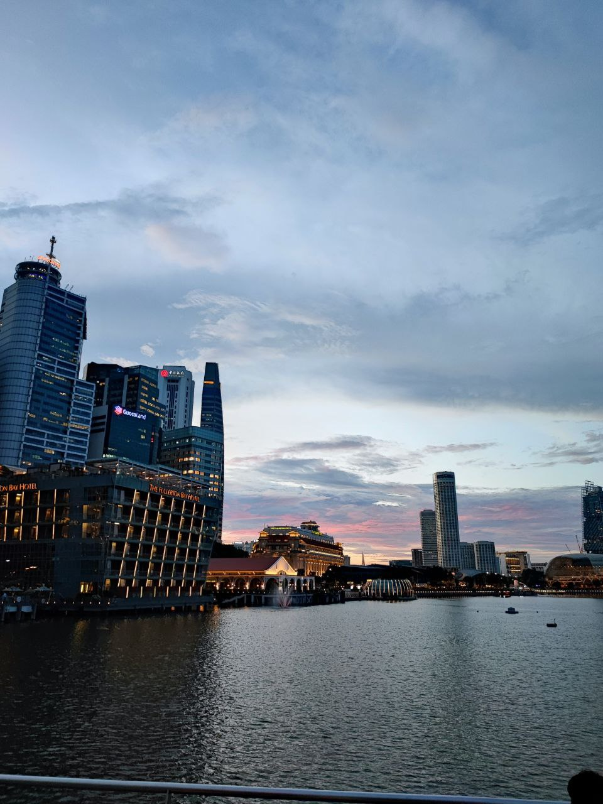

_Деловой центр. Фото из личного архива автора_

Ещё важный аспект касающийся именно айтишников. Здесь не настолько перегрет рынок труда, как в России, и нет доминирующего положения работника над работодателем. Здесь тебя могут уволить одним днём, и ты никому ничего не сможешь сказать. Зарплаты не повышают, просто чтобы удержать работника, потому что проще тебя отпустить и нанять другого. Здесь просто не принято так наглеть, как у нас. К этому надо привыкнуть. Карьерный рост более растянут, люди достаточно терпеливые. Они не привыкли, что всё должно происходить быстро.

А ещё дико бросается в глаза, что в Азии очень не распространено горизонтальное развитие скиллов. IT-индустрия здесь на этапе, когда ты инженер всего и сразу. Легче будет найти работу тем, у кого как можно больше аббревиатур в CV, вне зависимости от того, насколько хорошо ты их знаешь. В целом Сингапур — это такое место, куда стекаются все более-менее приличные айтишники из остальной Азии. Грубо говоря, ты дорастаешь до синьора на условных Филиппинах и потом переезжаешь миддлом в условный Сингапур или Гонконг.

Здесь представлены многие известные западные компании — Google, Microsoft и другие гиганты, у которых есть IT-отделы. Там всё неплохо и современно устроено. Но в целом в Азии есть такая особенность, что процессы не сильно развиты. Я сейчас интервьюирую кандидатов с рынка и слышу от них, что они тесты не писали никогда в жизни. Для них IT — это не крафтманшип, как мы его себе представляем, а работа лопатой. Вот ты пришёл, ты инженер, ты это умеешь. Там нужно пайплайн запилить — иди и пили. Здесь нужно фронтенд на сайте поменять — иди меняй. Это твоя работа, ты это умеешь, иди делай. То есть у них нет такой чёткой специализации, и они не сильно заморачиваются насчёт развития сотрудников, их теоретической подготовки. Для них единственный критерий успешности — если ты адекватно справляешься со своими задачами. Зачастую бывает, что у синьоров много лет опыта, они сложные задачи решают на практике, но теоретический уровень у них “джуниор минус”. То есть они вообще ничего не знают. Вот такая культура.

В целом в Сингапуре достаточно много сильных стартапов. Эта движуха пострадала от коронавирусных ограничений, потому что все сидели дома, но сейчас всё постепенно востанавливается. Проводятся блокчейн-фестивали, мероприятия, посвящённые NFT, и другие модные движухи. Всё как в других крупных IT-центрах.

## Отношение к иностранцам и россиянам в частности

Сингапур задумывался как многонациональное место. Много усилий было приложено, чтобы подружить китайскую, индийскую и малайскую культуру. Это всё очень жёстко было поначалу, но сейчас все сосуществуют без ярко выраженных конфликтов. Поэтому приезжих много и к ним тоже абсолютно нормальное отношение. Гражданство здесь получить очень трудно, но многие живут и работают. И сингапурцы понимают, что это люди, которые платят налоги и помогают сделать их жизнь лучше.

Отношение к россиянам пока нейтральное. Я допускаю, что на государственном уровне со временем могут начаться какие-то сложности, потому что Сингапур тяготеет к американскому и европейскому политическому курсу. Но в целом для сингапурского народа то, что происходит в Европе, это как на Плутоне, им абсолютно не интересно, это не их контекст.

Некоторые вполне адекватные сингапурцы, услышав, что я из России, хвалят Путина, потому что они поддерживают политику Китая, а Китай как бы поддерживает Россию. Они абсолютно не понимают, что там творится, кто на кого напал. Они считают, что всё происходит правильно, потому что их партия это поддерживает.

Для Сингапура самое важное, самое тяжёлое историческое событие — это оккупация Японией во время Второй мировой войны. Какое-то время японцы держали их под своим гнётом. Гнёт заключался в том, что, когда началось мародёрство, японские командиры стали своих же солдат публично наказывать, чтобы предотвратить беспорядки. В местном музее есть большой зал, посвящённый этой оккупации. Там на огромной стене написано, что в составе японской армии было два танка. В составе армии союзников, которая обороняла Сингапур, было ноль танков.

_Экспозиция в Национальном музее Сингапура. Фото из личного архива автора_

То есть вот такого уровня исторические события для них являются очень важными и весомыми. И после этого десятки лет они просто строили своё общество, развивались, отстроили эти восхитительные кондоминиумы и социальное жильё, которое называется HDB, превратили трущобы и аналоги наших панелек в по-настоящему респектабельную недвижимость. Они занимались обществом, строили торговлю, и во внешнеполитическую ситуацию Сингапур никогда особо не вмешивался. Это тоже очень хотелось почувствовать: каково жить в стране без имперских замашек. Здесь люди считают, что их страна великая, потому что в ней хорошо, а не потому, что она много других стран поставила на колени. 